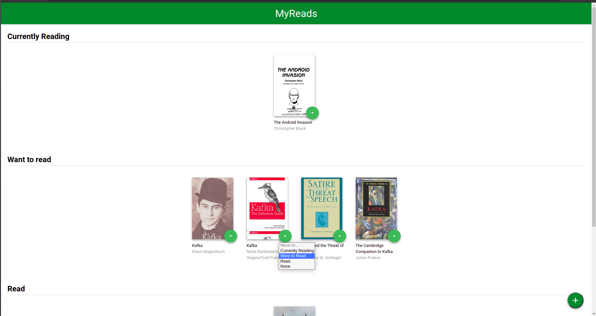
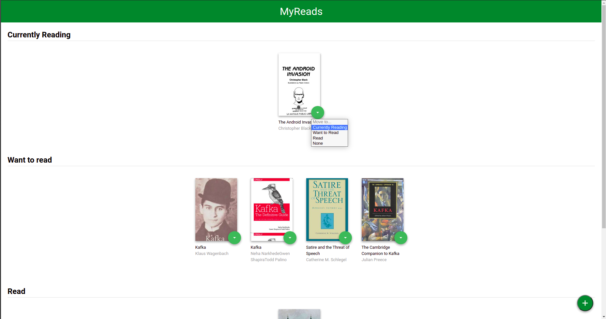
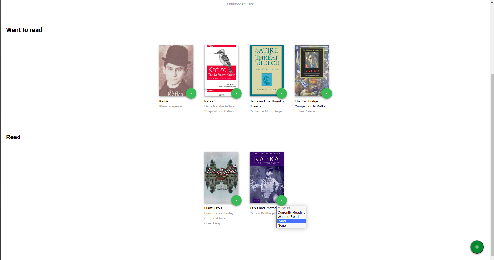
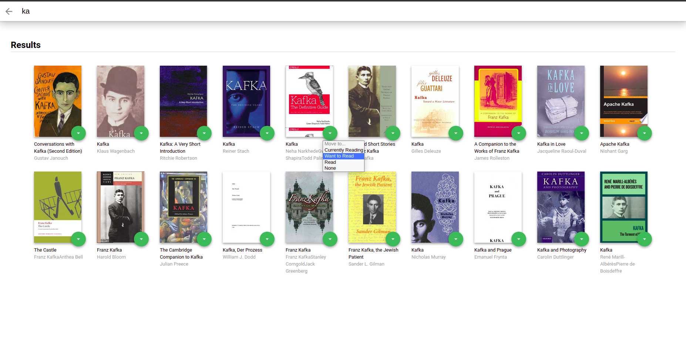
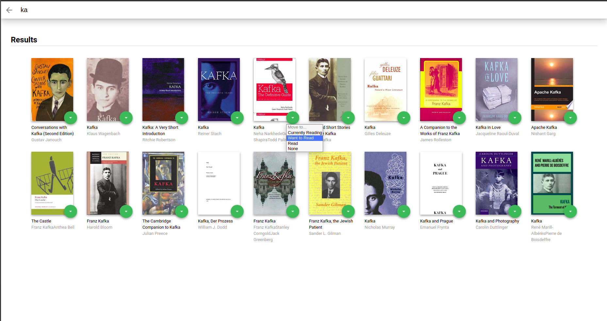
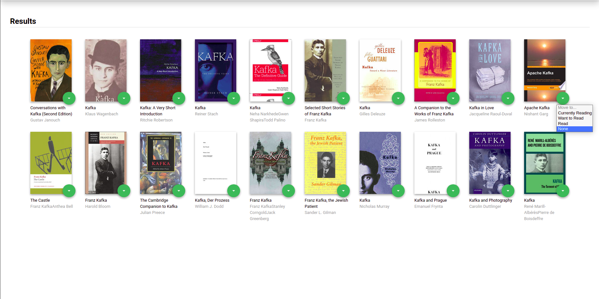

# MyReads Project

This is a Udacity React ND program project. 
In this project the user will have a dynamic reading App, that has a wide book library to search from.
the user will be able to categorize his books [Want to read, Read, Reading, none].

### run the App:
* install all project dependencies with `npm install`
* start the development server with `npm start`

## The project structure:

The main components [Book, Library, Search, Shelf] with the App (parent compoment)
-The Book component represents the book Element with all its properties {book title, book image, book authors, book style}, and this component sends the Shelf Component (props) data to fill in the shelves.

-The Shelf Component generates the shelves grid (<li>) each with its properties and callback function. The shelf component supplies the library page with the main 3 shelves filled with the (books with shelf categorey selected). The shelves are [Want to read, Reading, read ].

-The Library and the Search component are the main pages :
 --The Library component is the home page of the App, which presents the shelves with the chosen books and the search button that routes to the Search page
 --The Search page has the search input box and a shelf for results and a back arrow routes to the home page (Library page)

## API-BooksAPI:
The backend API uses a fixed set of cached search results and is limited to a particular set of search terms, which can be found in [SEARCH_TERMS.md](SEARCH_TERMS.md). That list of terms are the _only_ terms that will work with the backend, so don't be surprised if your searches for Basket Weaving or Bubble Wrap don't come back with any results.

## Screnshots for the App:

- ## Library page:

 

--
- ## Search page:

- ## Code:

